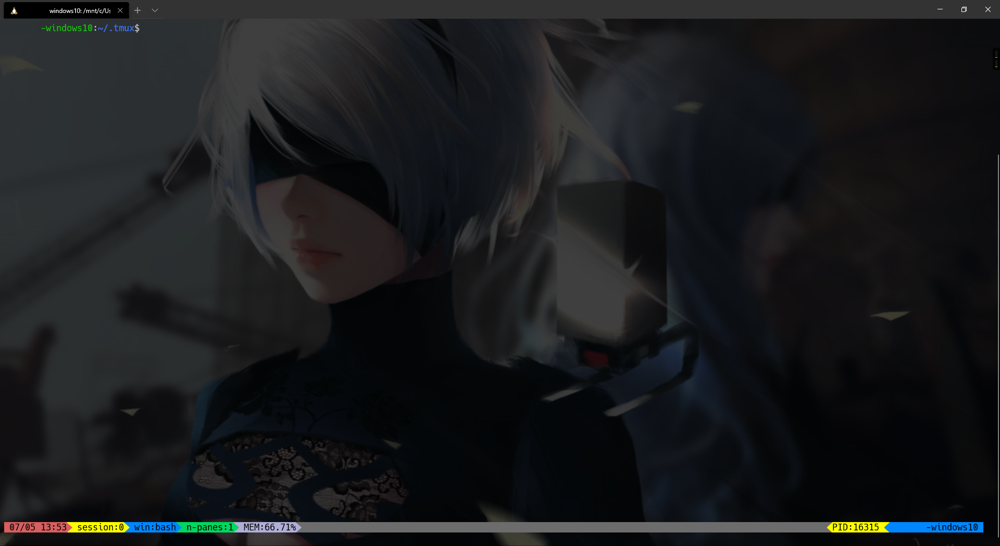

colorful tmux status
====================

Colorful your tmux status bar. Select a [powerline font](https://github.com/powerline/fonts).

Install
--------

```shell script
cd ~
git clone https://github.com/sunyakun/colorful-tmux-status
cp colorful-tmux-status/.tmux.conf ~/.tmux.conf
```

Screenshot
---------

